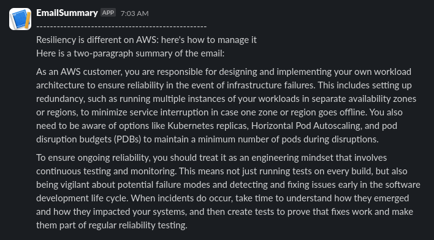

A Thunderbird addon that summarises new emails with Ollama and then forwards the summary to Slack (or whatever you code the extension to do).

Using Ollama means email contents is not sent to an external LLM.

## Installation

1. Windows users install WSL2 using the instructions [here](https://learn.microsoft.com/en-us/windows/wsl/install)
2. Install Ollama using the instructions [here](https://ollama.com/download/linux)
3. Create a systemd service using the instructions [here](https://github.com/ollama/ollama/blob/main/docs/linux.md#adding-ollama-as-a-startup-service-recommended)
4. Modify the systemd service file at `/etc/systemd/system/ollama.service` to include `Environment="OLLAMA_ORIGINS=moz-extension://*"`. This allows Ollama to receive network requests from Thunderbird.
5. Enable the service with `sudo systemctl enable ollama`
6. Start the service with `sudo systemctl start ollama`
7. Install `llama3` with the command `ollama run llama3.1`
8. Run `build.sh`
9. In Thunderbird, open the hamburger menu, click `Add-ons and Themes`, click `Extensions`, click the gears icon, click `Install Add-on From File`
10. Select the zip file called `thunderbirdollama.zip` created by the `build.sh` script
11. Set your [Slack webhook URL](https://api.slack.com/messaging/webhooks) in the extension preferences

## MacOs

Run this command to allow Thunderbird to access Ollama:

```bash
launchctl setenv OLLAMA_ORIGINS "moz-extension://*"
```

## Example

This is what the extension looks like:


This is the kind of summary you can expect:


